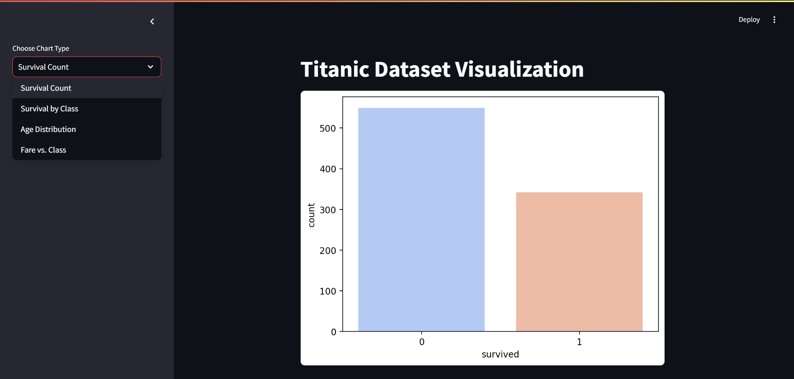

# Titanic Visualization App 🚢📊  

This is a **Streamlit-based web application** that visualizes the Titanic dataset.  
It provides various interactive visualizations to explore **passenger survival, class distribution, age, and gender demographics**.

---

## **🔹 Features**  
✅ Interactive visualizations using **Matplotlib & Seaborn**  
✅ Passenger survival analysis based on **gender, age, and class**  
✅ Histogram, pie charts, and bar plots for in-depth insights  
✅ User-friendly interface powered by **Streamlit**  

---

## **🔹 Installation & Running the App**
To run this project locally, follow these steps:

### **Step 1: Clone the Repository**
```bash
git clone https://github.com/your-username/Titanic-Visualization.git
cd Titanic-Visualization

Step 2: Install Dependencies
bash
pip install -r requirements.txt

Step 3: Run the Streamlit App
bash
streamlit run app.py


## **🔹 Snapshots of the App**  

### **Home Page**



